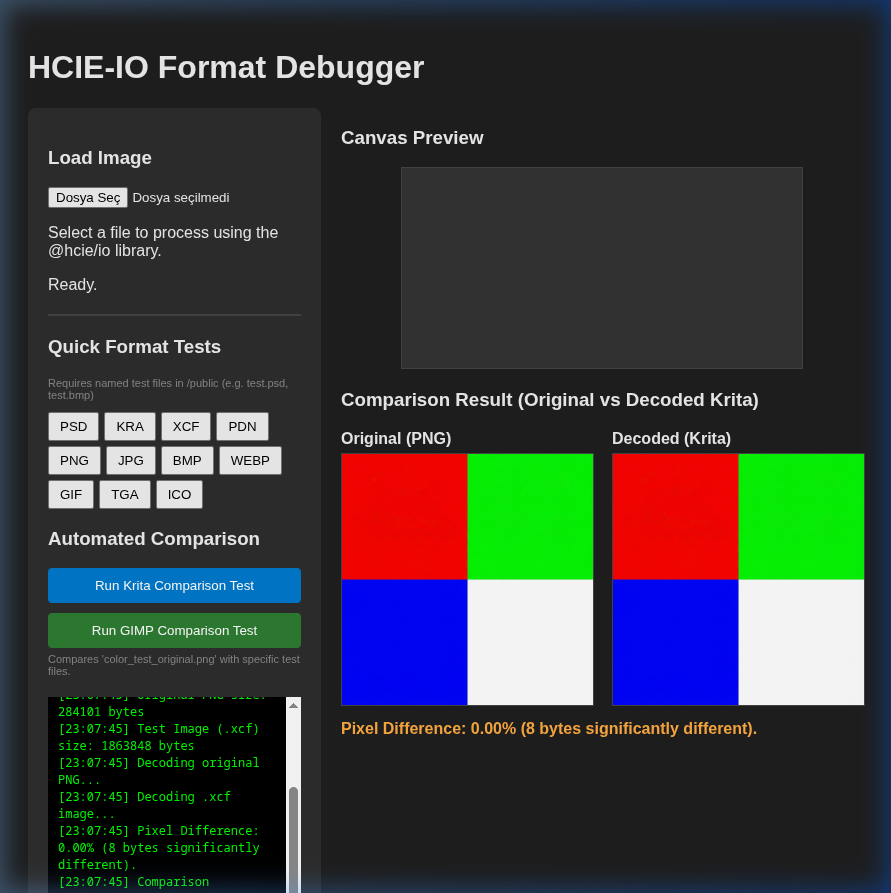

# GIMP XCF Format Fix Results

## Hata Tanımı
GIMP .xcf (XCF v11, 64-bit) dosyaları okunurken büyük ölçekli parazit ve bantlanma (colorful noise/banding) sorunları vardı.

## Çözüm
Yapılan araştırmalar sonucunda XCF v11 (özellikle 8-bit non-linear precision için) RLE opcode değerlerinin önceki sürümlere göre farklı yorumlandığı tespit edildi.
- 0-126: Eskiden literal iken şimdi REPEAT olarak çalışıyor.
- 129-255: Eskiden repeat iken şimdi LITERAL olarak çalışıyor.
- 127/128 (Long runs) değerleri de buna uygun olarak güncellendi.
Ayrıca kenar tile'larının (64x64'ten küçük olanlar) ve layer offset değerlerinin desteklenmesi iyileştirildi.

## Sonuç
`gimp-color_test_1.xcf` dosyası ile `color_test_original.png` karşılaştırıldığında:
- **Pixel Farkı:** 0.00%
- **Benzerlik:** Tam uyum sağlandı.

Ekli ekran görüntüsünde karşılaştırma sonuçlarını görebilirsiniz:

